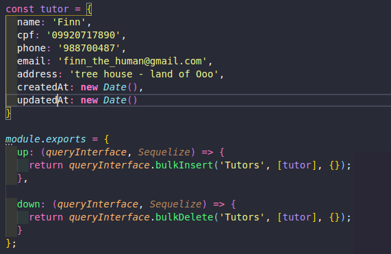

# Mini tutorial [Sequelizer](https://sequelize.org/v5/)

Basicamente, são 3 coisas importantes para a construção do banco de dados:

  - Models: são as entidades, manipuladas no código, que representam nossas tabelas, e suas respectivas relações, do banco de dados.
  - Migrations: são um bloco de código, que geralmente defini o que deve ter na tabela e como a mesma se relaciona, que quando executado, a alteração é aplica diretamente no banco de dados
  - Seeds: são valores para popular o banco de dados
  
---

# Model/migration

O sequelize permite a criação do model, e sua respectiva migration automaticamente, por linha de comando. Sendo necessário definir apenas o nome do model, seus atributos e tipos.

> criando model e migration
```sh
$ npx sequelize-cli model:generate --name Tutor --attributes name:string,cpf:string,phone:string,email:string,address:text
```

OBS1: você não precisa definir o id como atribute, pois ele já é criado automaticamente na migration

OBS2: os atributos oriundos de assosiações (chaves estrangeiras), serão definidos posteriormente

É importante explicar que no migration, tudo que estiver dentro da função up é o que o sequelize irá subir para o banco de dados, quando a migration for executada, logo, por consequinte, o que esta dentro da função down, é o que o sequelize irá retirar do banco de dados se for requerido que a migration seja desfeita.

Com isso, o sequelize cria automaticamente o esqueleto do model e do migration.Com o mesmo pronto, nos cabe adicionar os detalhes, tais quais, se determinado atributo é unico, ou se outoa precisa de alguma validação, e definir qual o comportamento quando alguma tabela for excluida.Sendo assim, acrescentando algumas dessas validações, temos:


Finalmente, criamos a entidade Event:

> criando model e migration
```sh
$ npx sequelize-cli model:generate --name Tutor --attributes name:string,cpf:string,phone:string,email:string,addres:text
```
### Associações
As associações no sequelize são de 3 tipos, de forma geral:
##### One-to-One
Aqui o intuito primordial seria associar o Id de uma tabela, a outra. Supondo dois models, A e B, de forma que A_id esteja na tabela B, podemos fazer:

```
A.hasOne(B);
B.belongsTo(A);
```

##### One-to-Many
No nosso contexto, onde um Tutor tem varios eventos e um evento so pode pertencer a um Tutor, temos esse tipo de relação. Logo, as associações corretas, de forma que o tutorId fique em Event, são:

```
Tutor.hasMany(Event);
Event.belongsTo(Tutor);
```

Indo para o nível de código, temos:

> No model de Tutor:


> No model do Event


> Na migration do Event


##### Many-to-Many
Esse tipo de relação é a que gera tabelas associativas. Sendo assim, duas tabelas pertencem uma a outra por meio de uma tabela intermediaria. 
Nesse contexto, suponha uma tabela Filme e outra Ator, onde um filme tem varios atores e um ator pode participar de varios filmes, teriamos então que:

```
const Movie = sequelize.define('Movie', { name: DataTypes.STRING });
const Actor = sequelize.define('Actor', { name: DataTypes.STRING });
const ActorMovies = sequelize.define('ActorMovies', {
	MovieId: {
		type: DataTypes.INTEGER,
		references: {
			model: 'Movies',
			key: 'id'
		}
	},
	ActorId: {
		type: DataTypes.INTEGER,
		references: {
			model: 'Actors',
			key: 'id'
		}
	}
});
Movie.belongsToMany(Actor, { through: 'ActorMovies' });
Actor.belongsToMany(Movie, { through: 'ActorMovies' });
```

Para finalizar, basta rodar as migrate:
```sh
$ npm run migrate
```
ou
```sh
$ npx sequelize-cli db:migrate
```

OBS1: você deve ter o banco de dados criado a as variáveis de ambiente devidamente configuradas.
OBS2: enquanto você estiver na sua branch, você pode mexer o quanto quiser na sua migration até a julgar pronta, no entanto, você `não deve` mexer em migrations ja prontas, se precisar modificar algo, faça uma nova migration!


---

# Seeds

A seeds são exemplos de valores de cada tabela, que usamos para popular o banco de dados, sendo importante ressaltar que cada entidade/tabela do banco de dados tem sua seed, podendo ser alterado uma seed já existente.

>Criando seed
```sh
$ npx sequelize-cli seed:generate --name demo-tutor
```
Após executado o comando, é criado o esqueleto da seed, tal que a função up e down segue a mesma lógica da migration. Apóis isso, devemos definir os dados a serem subidos na seed.

> Adicionando dados


>Executando seeds
```sh
$ npm run seed
```
ou
```sh
$ npx sequelize-cli db:seed:all
```

---

Para mais detalhes veja:
* [Definição de models](https://sequelize.org/v5/manual/models-definition.html)
* [Migrations](https://sequelize.org/master/manual/migrations.html)
* [Validações](https://sequelize.org/master/manual/validations-and-constraints.html)
* [Associações](https://sequelize.org/master/manual/assocs.html#one-to-many-relationships)
* [Data types](https://sequelize.org/master/manual/model-basics.html#data-types)
